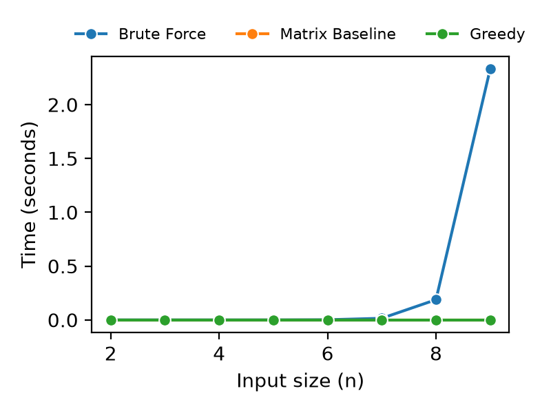
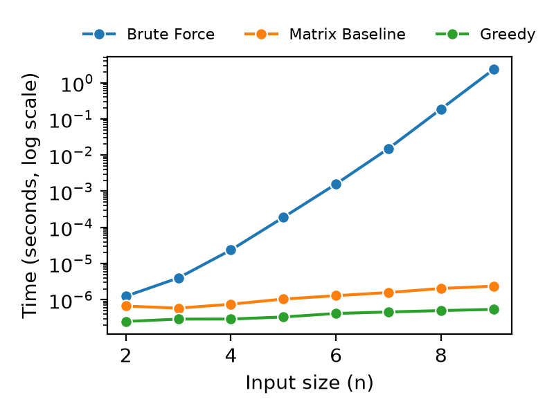
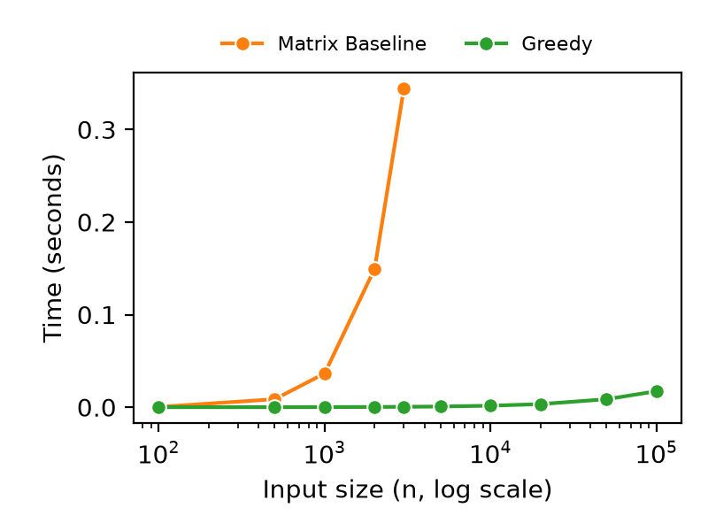
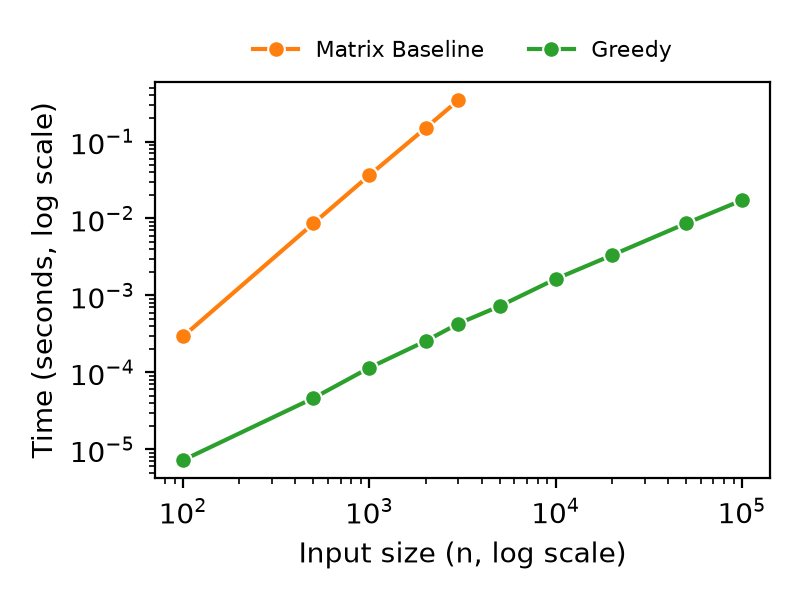

# Empirical Evaluation

## Overview

We implemented our three algorithms (`src/methods.py`) that solve the Mentor Pairing problem:

1. **Brute Force Algorithm:** A naive approach that exhaustively explores all possible matching decisions for every incoming student.
2. **Baseline Algorithm:** A less naive approach that sorts the students, creates a matrix that stores every possible pair, and then scans the matrix row by row with a column pointer that only moves forward.
3. **Greedy Algorithm:** An efficient greedy approach that sorts the students from least to most experience, then walks both sorted lists with two forward moving pointers, advancing both pointers when a pair is formed and only the senior pointer otherwise.

In `planning.md` the Baseline Algorithm is called Baseline Solution 1, the Brute Force Algorithm is called Baseline Solution 2, and the Greedy Algorithm is the proposed algorithm. The plot legends label the Baseline Algorithm as Matrix Baseline.

Unit testing (`src/tests.py`) confirms that the algorithms return the correct maximum pair count across multiple typical and edge cases (empty lists, ties, etc.).

## Benchmarking Results

We compare the performance of our three algorithms on randomly generated inputs with max_score = 1000 (`src/benchmark.py`), varying input size (n) from 2 to 100,000 students per list. Incoming scores are sampled from 1 to 500 and senior scores from 501 to 1000, creating many valid pairings and a consistently difficult case for the brute force algorithm. Each input size was measured over five trials, and the median execution time was used for the plots and subsequent analysis. We present the results in the plots below. The left plot shows the execution time on a linear scale. In this plot, once the input size reaches 9 students per list, it takes about 2.3 seconds for the brute force algorithm to execute. The right plot uses a logarithmic scale for the y axis. The reason for this is to make the graph more readable, as it is impossible to tell where the baseline algorithm is. After switching to a logarithmic scale for the y axis (shown in the right plot), notice that the baseline algorithm is slower than the greedy algorithm because the entirety of the baseline algorithm's line segments, from 2 through 9 students per list, is above the greedy algorithm's line segments.

|  |  |
| ------------------------------------------------------------- | -------------------------------------------------------------- |

Next, we compare the performance of the Baseline Algorithm and Greedy Algorithm for more clarity on which one is better at much higher input sizes. The Baseline Algorithm is only measured up to $n = 3{,}000$ because its matrix of every possible pair stores $n^2$ tuples, which already requires roughly 600 MB at that size (see `MAX_BASELINE_SIZE` in `src/benchmark.py`). This memory cost is itself evidence of the $\mathcal{O}(n^2)$ space bound given in `planning.md`. The left plot uses a logarithmic scale for the input size on the x axis and a linear scale for execution time on the y axis, while the right plot uses logarithmic scales for both axes. Again, we made the execution time axis logarithmic to show the difference in execution time more distinctly (shown in the right plot). This shows no clear overlap between the line segments. The log-log plot also lets us read the growth rate directly: a running time of the form $n^c$ appears as a straight line of slope $c$. Fitting the measured medians gives a slope of 2.08 for the Baseline Algorithm and 1.13 for the Greedy Algorithm, which is consistent with the $\mathcal{O}(n^2)$ and $\mathcal{O}(n \log n)$ bounds predicted in `planning.md`.

|  |  |
| --------------------------------------------------------------- | ---------------------------------------------------------------- |

The empirical data aligns with our theoretical complexity analysis (`planning.md`):

- **Brute Force Exponential Scaling**: The brute force algorithm has a worst-case upper bound of $\mathcal{O}(n(n+1)^n)$ due to exhaustively exploring the possible matching decisions for every incoming student.
- **Baseline Quadratic Scaling**: The baseline algorithm theoretically scales at $\mathcal{O}(n^2)$ due to constructing a $k$ by $n$ matrix containing every possible incoming-senior pair. At $n = 9$, the baseline algorithm is orders of magnitude faster than the brute force algorithm. The baseline algorithm is almost **1,000,000 times faster**, demonstrating the advantage of replacing exhaustive combinatorial search with a structured greedy scan, even though the matrix-based baseline still requires quadratic time and space.
- **Greedy Algorithm Efficiency**: The greedy algorithm scales at $\mathcal{O}(n \log n)$, constrained almost entirely by Python's built-in sorting algorithm. Sorting 100,000 students per list and performing the $\mathcal{O}(n)$ two-pointer traversal takes just 0.0173 seconds. At $n = 3,000$, the greedy algorithm is several orders of magnitude faster than the baseline algorithm. In particular, the greedy algorithm is approximately **800 times faster**.
